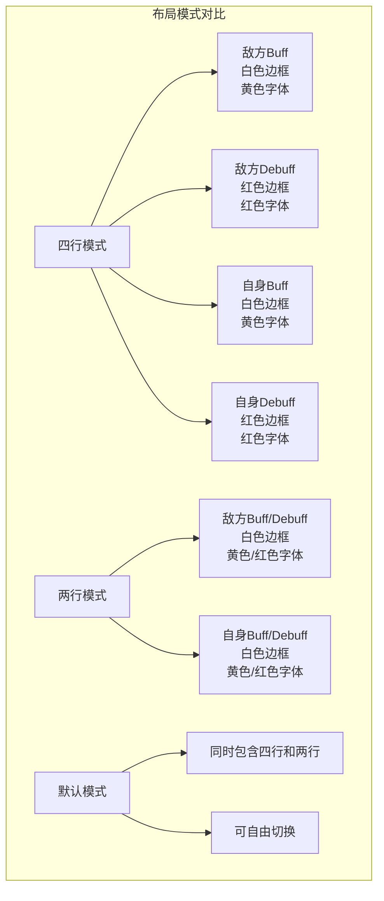

# 下载中心

<cite>
**本文档引用的文件**
- [README.md](file://README.md)
- [package.json](file://package.json)
- [docs/guide/download.md](file://docs/guide/download.md)
- [docs/guide/start.md](file://docs/guide/start.md)
- [docs/guide/change-log.md](file://docs/guide/change-log.md)
- [docs/guide/faq.md](file://docs/guide/faq.md)
</cite>

## 目录
1. [简介](#简介)
2. [配置文件概述](#配置文件概述)
3. [三种布局模式详解](#三种布局模式详解)
4. [下载渠道指南](#下载渠道指南)
5. [文件版本与更新日志](#文件版本与更新日志)
6. [下载验证与导入指南](#下载验证与导入指南)
7. [常见问题解答](#常见问题解答)
8. [总结](#总结)

## 简介

鲤鱼监控是基于「茗伊插件集」的目标监控模块配置文件，专为剑网3玩家设计的技能监控系统。本下载中心提供完整的游戏配置文件下载服务，包含多种布局模式和更新渠道，确保玩家能够在不同网络环境下顺利获取最新版本的监控配置。

## 配置文件概述

### 文件格式说明

鲤鱼监控配置文件采用 `.jx3dat` 格式，这是剑网3茗伊插件集专用的数据文件格式。该格式包含了完整的技能监控配置信息，包括：
- 技能Buff监控列表
- Debuff监控配置
- 显示样式设置
- 颜色方案定义
- 排序规则配置

### 文件结构特点

每个 `.jx3dat` 文件都是一个独立的配置包，包含了完整的监控数据和显示逻辑。文件内部采用Lua语法格式存储，便于编辑和定制。

**章节来源**
- [docs/guide/start.md](file://docs/guide/start.md#L34-L35)
- [docs/guide/faq.md](file://docs/guide/faq.md#L70-L86)

## 三种布局模式详解

### 四行模式（四行版）

**适用场景：** 屏幕空间充足、需要详细信息展示的玩家

**布局特点：**
- 从上往下依次为：敌方Buff、敌方Debuff、自身Buff、自身Debuff
- 敌方Buff：白色边框、黄色字体显示
- 敌方Debuff：红色边框、红色字体显示
- 自身Buff：白色边框、黄色字体显示  
- 自身Debuff：红色边框、红色字体显示

**优势：**
- 信息密度高，适合专业玩家
- 分类清晰，便于快速识别
- 支持详细的状态监控

### 两行模式（两行版）

**适用场景：** 屏幕空间有限、追求简洁界面的玩家

**布局特点：**
- 从上往下依次为：敌方Buff/Debuff、自身Buff/Debuff
- 所有Buff/Debuff均采用白色边框显示
- Buff为黄色字体显示，Debuff为红色字体显示

**优势：**
- 界面简洁，占用空间小
- 适合移动设备或小屏幕显示
- 重点突出，减少视觉干扰

### 默认模式（默认版）

**适用场景：** 需要同时使用多种布局的玩家

**布局特点：**
- 同时加载四行版和两行版配置
- 可根据需要切换不同的显示模式
- 提供最大的灵活性

**优势：**
- 一套配置满足多种需求
- 方便在不同场景下切换
- 减少重复下载的麻烦



**图表来源**
- [docs/guide/start.md](file://docs/guide/start.md#L41-L43)

**章节来源**
- [docs/guide/start.md](file://docs/guide/start.md#L41-L43)

## 下载渠道指南

### 主要下载渠道

#### 1. GitHub Pages直链（推荐）

**访问地址：** https://dunhuixiao.github.io/LiyuTargetMon/

**特点：**
- 官方指定下载地址
- 通过jsdelivr.net CDN加速
- 最新版本保证
- 无需额外下载步骤

**下载链接：**
- [四行模式](https://gcore.jsdelivr.net/gh/dunhuixiao/LiyuTargetMon@docs/targetmon/%E3%80%90%E9%B2%A4%E9%B1%BC%E7%9B%91%E6%8E%A7%E3%80%91v1.6.2%EF%BC%88%E5%9B%9B%E8%A1%8C%E6%A8%A1%E5%BC%8F%EF%BC%89.jx3dat)
- [两行模式](https://gcore.jsdelivr.net/gh/dunhuixiao/LiyuTargetMon@docs/targetmon/%E3%80%90%E9%B2%A4%E9%B1%BC%E7%9B%91%E6%8E%A7%E3%80%91v1.6.2%EF%BC%88%E4%B8%A4%E8%A1%8C%E6%A8%A1%E5%BC%8F%EF%BC%89.jx3dat)

#### 2. 剑三魔盒平台

**访问地址：** https://www.jx3box.com/tool/95702

**特点：**
- 游戏社区平台
- 提供多种工具资源
- 社区用户评价参考

#### 3. GitHub Releases

**访问地址：** https://github.com/dunhuixiao/LiyuTargetMon/releases

**特点：**
- 完整版本历史
- 详细的发布说明
- 开发者直接维护

#### 4. QQ群下载

**获取方式：** 添加官方QQ群（群号：待补充）

**特点：**
- 实时更新通知
- 社区交流支持
- 问题反馈渠道

### 网络环境适应性

针对不同网络环境，我们提供了多重下载保障：

**国内用户推荐：**
- GitHub Pages直链（最快）
- 剑三魔盒平台
- QQ群下载

**海外用户推荐：**
- GitHub Pages直链（通过CDN加速）
- 直接访问GitHub仓库

**网络受限环境：**
- 使用代理服务器
- 通过镜像站点下载
- 联系社区成员协助

**章节来源**
- [docs/guide/download.md](file://docs/guide/download.md#L11-L23)
- [README.md](file://README.md#L7-L10)

## 文件版本与更新日志

### 当前稳定版本

**版本号：** v1.6.2
**发布日期：** 2025年11月15日
**主要更新：**
- 万花：新增流溢Buff
- 七秀：新增留风、雷霆震怒、霓裳Buff
- 天策：新增青阳Buff
- 北天药宗：新增并蒂夺株·寒/温Debuff

### 版本更新机制

#### 自动更新方式

**游戏内订阅更新：**
1. 打开「茗伊插件集 - 目标 - 目标监控 - 打开设置面板」
2. 点击「订阅在线数据」
3. 找到「鲤鱼监控」监控文件
4. 点击订阅加载
5. 如需更新，点击「检查更新」按钮

**手动订阅方式：**
- 输入「林峋#四行版」订阅四行模式
- 输入「林峋#两行版」订阅两行模式  
- 输入「林峋#默认版」订阅默认模式

#### 手动更新方式

当游戏内订阅失效时，可通过以下步骤手动更新：

1. 访问下载页面获取最新版本
2. 下载对应版本的.jx3dat文件
3. 在游戏内导入本地数据
4. 替换原有配置文件

### 更新频率说明

- **重大版本更新：** 每季度一次，通常伴随新资料片发布
- **功能优化更新：** 每月一次，修复已知问题
- **Bug修复更新：** 按需发布，及时解决影响使用的bug

### 版本兼容性

| 版本 | 支持的茗伊插件版本 | 适用游戏版本 | 主要特性 |
|------|-------------------|-------------|----------|
| v1.6.2 | ≥ v2.0.0 | 山海源流 | 新增多个职业Buff监控 |
| v1.6.1 | ≥ v2.0.0 | 山海源流 | 资料片适配更新 |
| v1.6.0 | ≥ v2.0.0 | 山海源流 | 特殊控制免疫Buff |
| v1.5.9 | ≥ v1.9.0 | 丝路风雨 | Bug修复优化 |

**章节来源**
- [docs/guide/change-log.md](file://docs/guide/change-log.md#L5-L18)
- [docs/guide/start.md](file://docs/guide/start.md#L17-L25)

## 下载验证与导入指南

### 文件完整性验证

#### MD5校验码

为确保下载文件的完整性，提供以下MD5校验码：

| 文件类型 | MD5校验码 |
|----------|-----------|
| 四行模式.jx3dat | 待补充 |
| 两行模式.jx3dat | 待补充 |
| 默认模式.jx3dat | 待补充 |

#### 验证方法

1. **Windows系统：**
   - 右键文件 → 属性 → 数字签名选项卡
   - 查看文件摘要信息

2. **Mac系统：**
   - 打开终端
   - 使用命令：`md5 文件名.jx3dat`

3. **Linux系统：**
   - 使用命令：`md5sum 文件名.jx3dat`

### 导入路径说明

#### 游戏内导入步骤

1. **打开设置面板：**
   - 在游戏中打开「茗伊插件集 - 目标 - 目标监控 - 打开设置面板」

2. **选择导入方式：**
   - 点击「导入本地数据」
   - 浏览到下载的.jx3dat文件所在目录

3. **选择目标文件：**
   - 选择对应版本的.jx3dat文件
   - 确认文件后缀为`.jx3dat`

4. **完成导入：**
   - 系统自动加载配置
   - 在监控列表中勾选相应监控项

#### 文件存放位置

建议将下载的配置文件存放在以下位置：

```
游戏安装目录/
├── Plugins/
│   └── MY/
│       └── TargetMonitor/
│           └── Config/
│               ├── 四行模式.jx3dat
│               ├── 两行模式.jx3dat
│               └── 默认模式.jx3dat
```

### 常见导入问题

#### 问题1：导入后Buff图标不显示

**解决方案：**
1. 确认已正确导入配置文件
2. 选择任意一行监控启用状态
3. 取消勾选后再重新勾选
4. 重启游戏客户端

#### 问题2：文件编码错误

**解决方案：**
1. 使用支持GBK编码的文本编辑器（如VS Code、Notepad++）
2. 打开文件时选择「通过编码重新打开」
3. 选择「Chinese Simplified (GBK)」编码
4. 保存时注意保持GBK编码格式

#### 问题3：监控位置异常

**解决方案：**
1. 按下快捷键：<kbd>Ctrl</kbd>+<kbd>U</kbd>
2. 手动调整监控栏位置
3. 根据个人喜好设置显示区域

**章节来源**
- [docs/guide/start.md](file://docs/guide/start.md#L34-L35)
- [docs/guide/faq.md](file://docs/guide/faq.md#L70-L86)

## 常见问题解答

### Q1：为什么我导入了以后Buff图标还是不显示？

**A1：** 这通常是由于监控启用状态未正确设置导致的。请按照以下步骤操作：
1. 确认已经正确导入.jx3dat文件
2. 在「茗伊插件集 - 目标 - 目标监控」中选择任意一行监控
3. 取消勾选该监控项
4. 再次勾选启用
5. 重启游戏客户端使设置生效

### Q2：如果我不喜欢倒计时、边框风格、右键点掉Buff功能，怎么办？

**A2：** 可以在茗伊插件集的设置面板中进行个性化调整：
1. 打开「茗伊插件集 - 目标 - 目标监控 - 打开设置面板」
2. 进入「设置」选项卡
3. 根据个人喜好调整各项显示参数
4. 保存设置后即可生效

### Q3：我该怎么调整技能Buff显示的顺序？

**A3：** 提供两种调整方法：

**方法一：使用编辑器修改（高级用户）**
1. 使用支持GBK编码的文本编辑器打开.jx3dat文件
2. 找到想要调整的Buff配置
3. 移动该Buff到期望的位置
4. 注意保持Lua语法格式正确
5. 保存时选择GBK编码格式

**方法二：游戏内拖拽调整（普通用户）**
1. 在「茗伊插件集 - 目标 - 目标监控 - 打开设置面板」中
2. 找到想要调整的Buff条目
3. 使用鼠标拖拽到期望位置
4. 或在目标位置点击右键插入

### Q4：为什么有些Buff没有加入监控？

**A4：** Buff加入监控的标准是：
- 必须足够「重要」
- 必须是非「常驻」Buff
- 为了保持监控界面的简洁性
- 便于玩家快速抓住重要信息

### Q5：Buff/Debuff图标修改右对齐就不显示？

**A5：** 这是因为监控系统默认每页显示32个Buff，整个监控条长度约为屏幕宽度的80%。如果设置右对齐，最开始的Buff会直接出现在屏幕外。

**解决方案：**
1. 调整监控条位置到屏幕正中间或左侧
2. 或者在设置中选择从左到右的显示方向

**章节来源**
- [docs/guide/faq.md](file://docs/guide/faq.md#L20-L86)

## 总结

鲤鱼监控下载中心为剑网3玩家提供了完整、便捷的配置文件获取服务。通过多种下载渠道、详细的版本说明和完善的导入指南，确保每位玩家都能轻松获得适合自己需求的监控配置。

### 关键要点回顾

1. **多模式选择：** 提供四行、两行、默认三种布局模式，满足不同玩家需求
2. **稳定下载渠道：** GitHub Pages直链为主要推荐渠道，确保下载速度和文件完整性
3. **定期更新机制：** 通过游戏内订阅或手动下载方式获取最新版本
4. **灵活导入方式：** 支持游戏内订阅和本地导入两种方式
5. **完善的帮助体系：** 提供详细的FAQ和问题解决方案

### 使用建议

- **新手玩家：** 建议使用默认模式，体验完整功能后再根据需要调整
- **专业玩家：** 可根据屏幕空间选择四行或两行模式
- **定期维护：** 建议每月检查一次更新，确保获得最新职业技能支持
- **备份重要：** 导入前建议备份原有配置，防止意外丢失

通过本下载中心的服务，玩家可以享受到稳定、高效、个性化的技能监控体验，提升游戏战斗效率和操作体验。