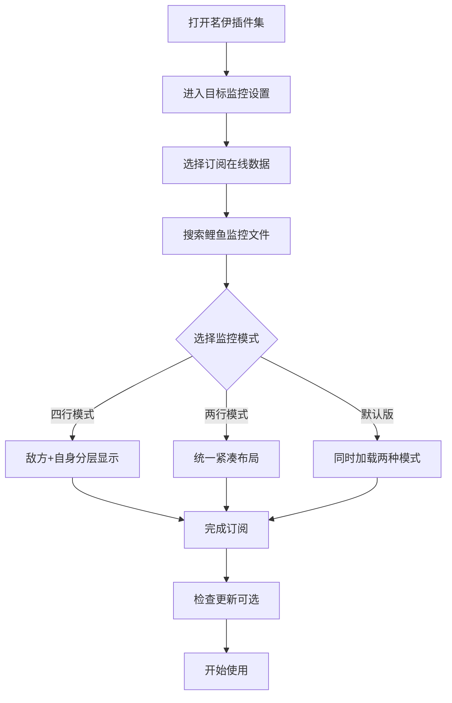
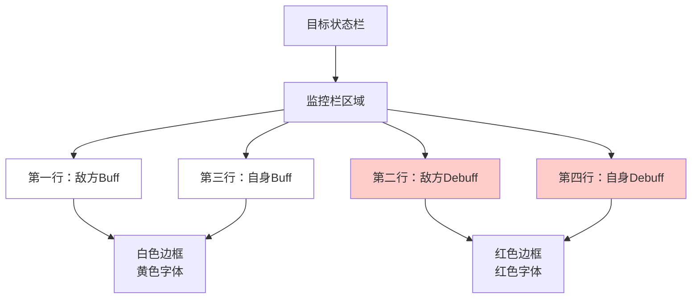

# 快速上手

<cite>
**本文档引用的文件**
- [README.md](file://README.md)
- [package.json](file://package.json)
- [docs/README.md](file://docs/README.md)
- [docs/guide/start.md](file://docs/guide/start.md)
- [docs/guide/download.md](file://docs/guide/download.md)
- [docs/guide/faq.md](file://docs/guide/faq.md)
</cite>

## 目录
1. [简介](#简介)
2. [两种主要接入方式](#两种主要接入方式)
3. [游戏内在线订阅流程](#游戏内在线订阅流程)
4. [本地文件导入方法](#本地文件导入方法)
5. [配置文件类型说明](#配置文件类型说明)
6. [首次启用后的效果](#首次启用后的效果)
7. [常见问题解答](#常见问题解答)
8. [下载与获取资源](#下载与获取资源)
9. [总结](#总结)

## 简介

鲤鱼监控是一款基于「茗伊插件集 - 目标监控模块」的配置文件，专为剑网3玩家设计。它提供了简洁高效的Buff/Debuff监控功能，帮助玩家更好地掌握战斗中的关键信息。

### 核心特点
- **开箱即用**：基于茗伊插件集实现，可直接导入监控数据使用
- **简洁克制**：只监控「重要」且「非常驻」的Buff/Debuff
- **开源透明**：监控数据内容明文，支持分享、修改和二次创作

## 两种主要接入方式

鲤鱼监控提供两种便捷的接入方式，满足不同用户的需求：

### 方式对比表

| 接入方式 | 优势 | 适用场景 | 更新频率 | 操作复杂度 |
|---------|------|----------|----------|------------|
| 游戏内在线订阅 | 自动更新、操作简单 | 新手用户、追求便利性 | 实时更新 | 极低 |
| 本地文件导入 | 离线使用、完全控制 | 高级用户、特殊需求 | 手动更新 | 中等 |

## 游戏内在线订阅流程

这是推荐给新手用户的首选方式，操作简单且自动更新。

### 完整操作步骤

#### 第一步：打开茗伊插件集设置面板
1. 在游戏中打开「茗伊插件集 - 目标 - 目标监控」
2. 点击「打开设置面板」进入配置界面

#### 第二步：订阅在线数据
1. 在设置面板中找到「订阅在线数据」选项
2. 系统会自动搜索可用的监控文件

#### 第三步：选择鲤鱼监控文件
1. 在搜索结果中找到「鲤鱼监控」相关文件
2. 点击选择对应的监控版本

#### 第四步：选择监控模式（可选）
系统提供三种预设模式：
- **四行模式**：敌方Buff/Debuff + 自身Buff/Debuff（上下分层显示）
- **两行模式**：敌方/自身统一显示（紧凑布局）
- **默认版**：同时加载四行和两行版本

#### 第五步：手动添加订阅（高级用户）
如果自动搜索未找到，可以手动添加：
- 输入「林峋#四行版」订阅四行模式
- 输入「林峋#两行版」订阅两行模式  
- 输入「林峋#默认版」订阅完整版本

#### 第六步：检查更新
- 如果已有订阅，点击「检查更新」按钮获取最新版本
- 远程有新版本时会自动重新加载

### 视觉参考

**图表来源**
- [docs/guide/start.md](file://docs/guide/start.md#L10-L27)

## 本地文件导入方法

适用于需要离线使用或特殊定制的高级用户。

### 下载与准备

#### 步骤一：获取监控文件
1. 访问[下载页面](guide/download.md)或通过QQ群获取
2. 下载对应版本的`.jx3dat`文件
   - 四行模式：包含完整的四行监控布局
   - 两行模式：精简的两行监控布局
   - 默认版：包含所有监控数据

#### 步骤二：文件验证
- 确保下载的文件后缀为`.jx3dat`
- 避免从非官方渠道下载，防止恶意程序

### 导入操作流程

#### 第一步：打开导入界面
1. 在茗伊插件集目标监控设置中
2. 选择「导入本地数据」选项

#### 第二步：选择文件
1. 浏览到下载的`.jx3dat`文件所在位置
2. 选择要导入的监控文件

#### 第三步：应用配置
1. 系统自动加载监控数据
2. 返回设置界面确认导入成功

### 视觉参考

**图表来源**
- [docs/guide/start.md](file://docs/guide/start.md#L35-L40)

## 配置文件类型说明

### 四行模式监控布局

四行模式采用分层显示策略，从上至下依次为：

| 层级 | 内容 | 显示样式 | 用途 |
|------|------|----------|------|
| 第一层 | 敌方Buff | 白色边框、黄色字体 | 对手增益效果 |
| 第二层 | 敌方Debuff | 红色边框、红色字体 | 对手减益效果 |
| 第三层 | 自身Buff | 白色边框、黄色字体 | 自身增益效果 |
| 第四层 | 自身Debuff | 红色边框、红色字体 | 自身减益效果 |

### 两行模式监控布局

两行模式采用统一显示策略，从上至下：

| 行级 | 内容 | 显示样式 | 区分方式 |
|------|------|----------|----------|
| 第一行 | 敌方Buff/Debuff | 白色边框 | 字体颜色区分 |
| 第二行 | 自身Buff/Debuff | 白色边框 | 字体颜色区分 |

### 字体颜色规则
- **Buff**：白色边框 + 黄色字体
- **Debuff**：红色边框 + 红色字体

## 首次启用后的效果

### 监控栏显示变化

启用鲤鱼监控后，目标状态栏将出现显著变化：

#### 基础显示效果
- 目标头像下方显示Buff/Debuff监控栏
- 按照预设的颜色和字体规则显示
- 实时更新Buff/Debuff状态

#### 位置调整功能
- 按下 <kbd>Ctrl</kbd>+<kbd>U</kbd> 键
- 将监控栏移动到理想位置
- 支持多种布局调整

### 通用数据同步

启用「使用通用数据」功能后：
- 本机所有角色共享同一份监控数据
- 减少重复配置工作
- 统一各角色的监控体验

### 视觉效果展示

**图表来源**
- [docs/guide/start.md](file://docs/guide/start.md#L41-L47)

## 常见问题解答

### 为什么导入后Buff图标不显示？

**解决方案**：
1. 确认已正确导入监控文件
2. 选择任意一行监控的启用状态
3. 取消勾选后再重新勾选
4. 重启游戏或刷新插件设置

### 如何自定义监控内容？

**添加自定义监控**：
1. 打开茗伊插件集目标监控设置面板
2. 选择目标监控集合
3. 点击「新建条目」创建新监控
4. 或在目标位置右键点击插入

### 如何调整显示样式？

**调整参数**：
- 图标缩放比例
- 图标文字（倒计时）大小
- 技能别名文字大小

这些设置可在「设置」面板中找到。

### 为什么某些Buff没有加入监控？

**原因说明**：
- 只监控「重要」且「非常驻」的Buff
- 为了保持监控界面的简洁性
- 避免信息过载影响判断

### 如何调整Buff显示顺序？

**两种方法**：
1. **编辑器修改**：使用VS Code等工具，用GBK编码打开`.jx3dat`文件，调整Buff顺序
2. **游戏内调整**：在设置面板中手动拖拽调整顺序

**图表来源**
- [docs/guide/faq.md](file://docs/guide/faq.md#L20-L86)

## 下载与获取资源

### 官方下载渠道

#### 主要下载地址
- **直接下载**：访问[下载页面](guide/download.md)获取最新版本
- **QQ群**：加入官方QQ群获取压缩包
- **GitHub**：从[发布页面](https://github.com/dunhuixiao/LiyuTargetMon/releases)下载

#### 下载注意事项
1. 确保文件后缀为`.jx3dat`
2. 避免从非官方渠道下载
3. 解压后确认文件完整性

### 其他相关信息

#### 论坛链接
- [剑三魔盒](https://www.jx3box.com/tool/95702)
- 历史贴吧链接（多个版本）

#### 社区支持
- GitHub Issues：[问题反馈](https://github.com/dunhuixiao/LiyuTargetMon/issues)
- QQ群：[官方交流群](https://jq.qq.com/?_wv=1027&k=jmw5fLpn)

**图表来源**
- [docs/guide/download.md](file://docs/guide/download.md#L11-L23)
- [docs/README.md](file://docs/README.md#L61-L72)

## 总结

鲤鱼监控提供了两种便捷的接入方式，让不同技术水平的玩家都能快速上手：

### 推荐使用方式
- **新手用户**：优先选择游戏内在线订阅流程
- **高级用户**：可考虑本地文件导入方法
- **团队协作**：启用通用数据功能实现统一配置

### 最佳实践建议
1. **定期检查更新**：确保使用最新版本的功能和修复
2. **备份配置**：重要配置文件做好备份
3. **社区参与**：积极参与社区讨论，获取最新资讯

### 后续学习路径
- 了解[FAQ](guide/faq.md)解决常见问题
- 探索[下载页面](guide/download.md)获取更多资源
- 加入官方社区获得更多帮助

通过以上步骤，您应该能够顺利安装和使用鲤鱼监控，提升您的游戏体验。如有任何疑问，欢迎随时查阅相关文档或寻求社区帮助。