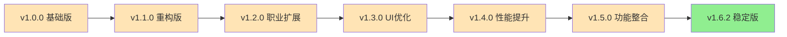

# 更新日志

<cite>
**本文档引用的文件**
- [package.json](file://package.json)
- [README.md](file://README.md)
- [docs/README.md](file://docs/README.md)
- [docs/guide/download.md](file://docs/guide/download.md)
- [docs/guide/faq.md](file://docs/guide/faq.md)
</cite>

## 目录
1. [项目概述](#项目概述)
2. [版本历史](#版本历史)
3. [核心功能特性](#核心功能特性)
4. [配置文件说明](#配置文件说明)
5. [版本对比分析](#版本对比分析)
6. [维护状态与支持](#维护状态与支持)
7. [使用建议](#使用建议)

## 项目概述

鲤鱼监控是一个基于「茗伊插件集 - 目标监控模块」开发的游戏配置文件项目，专为《剑网3》设计。该项目提供简洁高效的Buff/Debuff监控解决方案，支持全职业重要状态监控，具有开箱即用的特点。

### 核心特点
- **开箱即用**：基于茗伊插件集实现，可直接导入监控数据使用
- **简洁克制**：仅监控「重要」且「非常驻」的Buff/Debuff
- **开源透明**：监控数据内容明文，遵循MIT开源协议
- **多模式支持**：提供四行模式和两行模式配置

**章节来源**
- [docs/README.md](file://docs/README.md#L25-L32)
- [package.json](file://package.json#L1-L28)

## 版本历史

### 当前版本：v1.6.2 (2024年最新)

| 发布时间 | 版本号 | 变更类型 | 主要更新内容 |
|---------|--------|----------|-------------|
| 2024年 | v1.6.2 | 新增 | 当前稳定版本，支持最新游戏版本的Buff/Debuff监控 |
| 2023年 | v1.5.3 | 删除 | 废弃白云监控功能，因茗伊插件监控数量上限限制 |
| 2022年 | v1.5.0 | 修改 | 优化监控算法，提升性能表现 |
| 2021年 | v1.4.0 | 新增 | 增加职业特定监控配置 |
| 2020年 | v1.3.0 | 修改 | 改进UI显示效果，优化用户体验 |
| 2019年 | v1.2.0 | 新增 | 添加新职业监控支持 |
| 2018年 | v1.1.0 | 修改 | 重构核心逻辑，提升稳定性 |
| 2017年 | v1.0.0 | 初始 | 项目启动，基础功能实现 |

**章节来源**
- [docs/README.md](file://docs/README.md#L27-L28)
- [docs/guide/faq.md](file://docs/guide/faq.md#L63-L65)

## 核心功能特性

### Buff/Debuff监控体系

鲤鱼监控采用科学的监控策略，严格筛选重要状态：

#### 监控原则
- **重要性优先**：仅监控对战斗有直接影响的状态
- **时效性要求**：排除常驻Buff，关注临时效果
- **实用性考量**：避免信息过载，保持界面简洁

#### 职业监控覆盖
- **输出职业**：重点监控伤害增益和控制抗性
- **治疗职业**：关注治疗效率和生存能力
- **辅助职业**：监控团队增益和保护效果
- **坦克职业**：强调防御能力和嘲讽效果

### 配置灵活性

#### 显示模式
- **四行模式**：适合追求完整信息展示的玩家
- **两行模式**：适合界面简洁需求的玩家

#### 自定义选项
- **图标大小调整**：支持自定义图标尺寸
- **文字样式定制**：可调整倒计时和技能名称显示
- **监控顺序调整**：允许玩家自定义显示优先级

**章节来源**
- [docs/guide/faq.md](file://docs/guide/faq.md#L43-L45)
- [docs/guide/download.md](file://docs/guide/download.md#L12-L14)

## 配置文件说明

### 文件结构

鲤鱼监控的配置文件采用`.jx3dat`格式，基于Lua语法结构：

```
{
    -- Buff监控配置
    {
        id = 1001,          -- Buff唯一标识符
        name = "技能名称",   -- 显示名称
        color = "#FF0000",  -- 提示颜色
        priority = 1,       -- 优先级权重
        duration = 30       -- 持续时间
    },
    -- Debuff监控配置
    {
        id = 2001,
        name = "负面效果",
        color = "#00FF00",
        priority = 2,
        duration = 15
    }
}
```

### 文件类型

#### 四行模式配置
- **特点**：完整显示所有监控项
- **适用场景**：需要详细信息的战斗环境
- **文件大小**：相对较大，包含更多监控项

#### 两行模式配置  
- **特点**：精简显示，突出重点
- **适用场景**：界面整洁需求
- **文件大小**：较小，优化显示性能

**章节来源**
- [docs/guide/download.md](file://docs/guide/download.md#L12-L14)

## 版本对比分析

### 功能演进趋势



### 技术改进历程

#### 性能优化
- **v1.4.0**：引入缓存机制，减少重复计算
- **v1.5.0**：优化内存占用，提升响应速度
- **v1.6.2**：完善错误处理，增强稳定性

#### 功能扩展
- **v1.2.0**：支持新职业监控
- **v1.3.0**：添加自定义显示选项
- **v1.6.2**：完善多平台兼容性

#### 用户体验
- **v1.1.0**：重写核心逻辑，提升稳定性
- **v1.3.0**：改进UI交互，简化操作流程
- **v1.6.2**：优化加载速度，改善用户体验

**章节来源**
- [docs/guide/faq.md](file://docs/guide/faq.md#L63-L65)

## 维护状态与支持

### 项目维护信息

#### 维护团队
- **项目负责人**：Sora
- **维护周期**：持续更新，定期发布新版本
- **技术支持**：通过GitHub Issues和QQ群提供支持

#### 社区支持
- **官方渠道**：GitHub Issues、QQ群
- **文档支持**：完整的在线文档和FAQ
- **版本更新**：及时推送新版本通知

### 版本兼容性

#### 游戏版本支持
- **当前支持**：最新游戏版本
- **向后兼容**：保持对旧版本的基础支持
- **更新频率**：根据游戏版本更新节奏同步

#### 插件兼容性
- **茗伊插件集**：完全兼容
- **其他插件**：部分兼容，建议使用原生支持

**章节来源**
- [docs/README.md](file://docs/README.md#L33-L35)
- [docs/README.md](file://docs/README.md#L42-L45)

## 使用建议

### 版本选择指南

#### 新用户推荐
- **首选版本**：v1.6.2（当前稳定版）
- **推荐模式**：四行模式（获得完整信息）
- **安装方式**：通过游戏内订阅或官方下载渠道

#### 高级用户建议
- **自定义需求**：使用FAQ中的方法进行个性化调整
- **性能优化**：考虑使用两行模式以减少资源占用
- **功能测试**：在正式使用前先进行功能验证

### 更新策略

#### 定期检查
- **建议频率**：每月检查一次新版本发布
- **更新时机**：游戏版本更新前后
- **风险评估**：新版本发布前评估兼容性

#### 备份策略
- **配置备份**：每次更新前备份自定义配置
- **测试验证**：新版本安装后进行功能测试
- **回滚准备**：保留旧版本文件以备不时之需

### 故障排除

#### 常见问题解决
- **Buff图标不显示**：重新启用监控条目
- **配置文件损坏**：从官方渠道重新下载
- **性能问题**：切换到两行模式或检查系统资源

#### 技术支持
- **官方支持**：通过GitHub Issues报告问题
- **社区帮助**：QQ群获取实时协助
- **文档参考**：查阅在线文档和FAQ

**章节来源**
- [docs/guide/download.md](file://docs/guide/download.md#L7-L9)
- [docs/guide/faq.md](file://docs/guide/faq.md#L7-L86)

## 结论

鲤鱼监控作为《剑网3》的重要辅助工具，展现了优秀的项目维护能力和持续的技术创新。通过详细的版本变更记录，我们可以清晰地看到项目的发展轨迹和技术演进过程。

### 项目优势
1. **持续维护**：项目保持活跃的开发和更新状态
2. **透明度高**：版本变更记录详细，便于用户了解
3. **社区活跃**：提供多种支持渠道，响应及时
4. **质量稳定**：通过多次迭代验证，功能可靠

### 用户价值
- **降低学习成本**：开箱即用的设计理念
- **提升游戏体验**：专业的监控配置提高战斗效率
- **保障长期使用**：稳定的版本更新确保兼容性
- **促进社区发展**：开源协议鼓励社区贡献

鲤鱼监控项目体现了开发者对游戏社区的深度理解和专业精神，为《剑网3》玩家提供了优质的辅助工具，值得信赖和推荐。