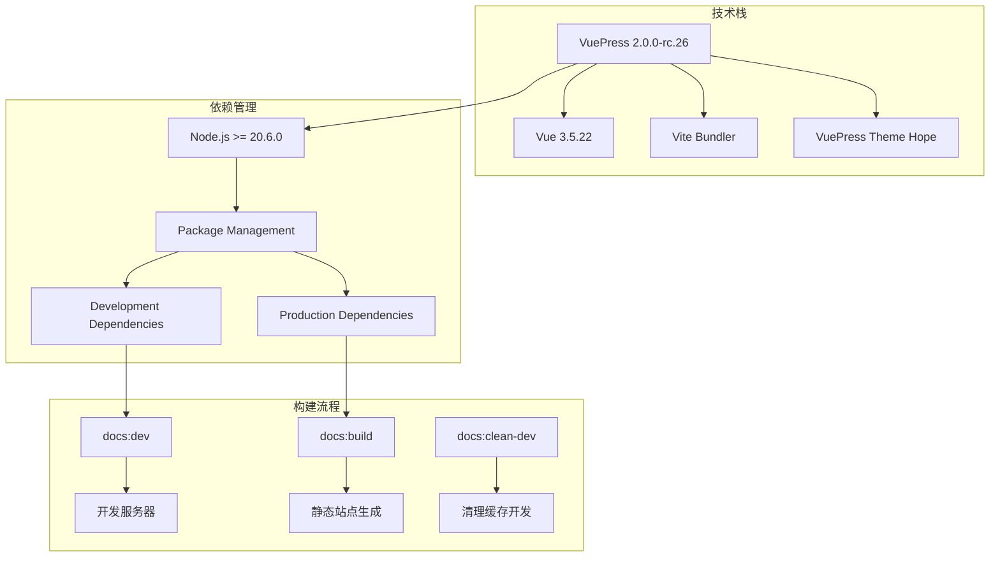
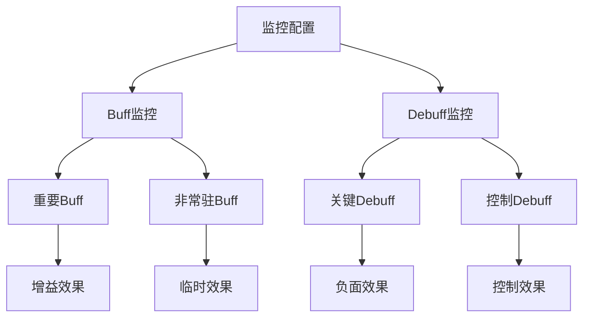

# 项目概述

<cite>
**本文档引用的文件**
- [README.md](file://README.md)
- [package.json](file://package.json)
- [package-lock.json](file://package-lock.json)
- [docs/README.md](file://docs/README.md)
- [docs/guide/download.md](file://docs/guide/download.md)
- [docs/guide/start.md](file://docs/guide/start.md)
- [docs/guide/faq.md](file://docs/guide/faq.md)
- [docs/guide/change-log.md](file://docs/guide/change-log.md)
</cite>

## 目录
1. [项目简介](#项目简介)
2. [核心功能特性](#核心功能特性)
3. [技术架构](#技术架构)
4. [项目结构](#项目结构)
5. [使用指南](#使用指南)
6. [配置文件详解](#配置文件详解)
7. [扩展与定制](#扩展与定制)
8. [社区与支持](#社区与支持)
9. [许可证与版权](#许可证与版权)

## 项目简介

LiyuTargetMon（鲤鱼监控）是一个专为《剑网3》设计的Buff/Debuff监控配置文件项目，基于「茗伊插件集 - 目标监控模块」构建。该项目为玩家提供直观的战斗状态监控，帮助玩家更好地掌握战场局势和技能效果。

### 核心价值主张

- **开箱即用**：基于成熟的茗伊插件集目标监控模块，无需复杂配置即可使用
- **简洁高效**：专注于重要且非常驻的Buff/Debuff监控，保持界面清爽
- **开源透明**：监控数据内容明文存储，遵循MIT开源协议，支持自由分享和修改

### 项目定位

LiyuTargetMon作为一款专业的游戏辅助工具，旨在：
- 提升玩家的战斗意识和技能管理能力
- 提供标准化的Buff监控解决方案
- 构建活跃的社区生态，促进经验分享

**章节来源**
- [README.md](file://README.md#L1-L20)
- [docs/README.md](file://docs/README.md#L25-L35)

## 核心功能特性

### 监控模式

项目提供两种主要的监控显示模式：

#### 四行模式
- **敌方Buff**：监控敌方的重要Buff效果
- **敌方Debuff**：监控敌方的关键负面效果
- **自身Buff**：监控自身的增益效果
- **自身Debuff**：监控自身的负面效果

#### 两行模式  
- **敌方Buff/Debuff**：统一监控敌方状态效果
- **自身Buff/Debuff**：统一监控自身状态效果

### 视觉标识系统

- **Buff显示**：白色边框搭配黄色字体
- **Debuff显示**：红色边框搭配红色字体
- **动态调整**：支持Ctrl+U快捷键调整监控栏位置

### 更新机制

- **在线订阅**：支持游戏内订阅更新，自动获取最新版本
- **本地导入**：支持直接下载.jx3dat文件本地导入
- **手动更新**：提供多种下载渠道确保资源获取

**章节来源**
- [docs/guide/start.md](file://docs/guide/start.md#L40-L45)
- [docs/guide/download.md](file://docs/guide/download.md#L12-L15)

## 技术架构

### VuePress文档系统

项目采用VuePress构建静态文档网站，具有以下特点：



**图表来源**
- [package.json](file://package.json#L10-L15)

### 核心依赖组件

| 组件 | 版本 | 用途 |
|------|------|------|
| vuepress | 2.0.0-rc.26 | 主要文档框架 |
| vuepress-theme-hope | 2.0.0-rc.98 | 主题渲染引擎 |
| vue | 3.5.22 | 前端框架 |
| @vuepress/bundler-vite | 2.0.0-rc.26 | 构建工具链 |
| json5 | 2.2.3 | JSON解析增强 |
| d3-color | 3.1.0 | 颜色处理工具 |

### 配置文件格式

项目使用.jx3dat格式作为配置文件，这种格式具有以下优势：

- **明文存储**：配置内容以人类可读的方式存储
- **Lua兼容**：支持Lua语法格式化查看
- **易于编辑**：支持GBK编码的文本编辑器直接修改
- **结构化**：采用层次化的数据结构组织监控配置

**章节来源**
- [package.json](file://package.json#L16-L27)
- [docs/guide/faq.md](file://docs/guide/faq.md#L71-L79)

## 项目结构

### 目录布局

```
LiyuTargetMon/
├── README.md                 # 项目主文档
├── package.json             # 项目配置文件
├── package-lock.json        # 依赖锁定文件
└── docs/                    # VuePress文档目录
    ├── README.md            # 首页文档
    ├── guide/               # 使用指南
    │   ├── download.md      # 下载指南
    │   ├── start.md         # 快速开始
    │   ├── faq.md           # 常见问题
    │   └── change-log.md    # 更新日志
    └── .vuepress/           # VuePress配置
```

### 文件类型说明

- **README.md**：项目基本信息和快速入门指南
- **package.json**：Node.js项目配置，包含依赖和脚本定义
- **docs/**：完整的VuePress文档系统，包含使用指南、FAQ和更新记录

### 文档站点特性

- **响应式设计**：适配各种设备访问
- **搜索功能**：内置全文搜索能力
- **多语言支持**：支持国际化内容
- **版本控制**：记录详细的更新历史

**章节来源**
- [docs/README.md](file://docs/README.md#L1-L23)

## 使用指南

### 快速开始

#### 方式一：游戏内订阅更新（推荐）

1. **打开设置面板**：在游戏内进入「茗伊插件集 - 目标 - 目标监控 - 打开设置面板」
2. **订阅在线数据**：点击「订阅在线数据」选项
3. **选择监控文件**：找到「鲤鱼监控」监控文件并点击订阅加载
4. **选择版本**：可以选择四行版、两行版或默认版（同时加载两个版本）

#### 方式二：手动下载导入

1. **下载监控文件**：从[下载页面](guide/download.md)获取.jx3dat文件
2. **导入本地数据**：在设置面板中点击「导入本地数据」
3. **选择文件**：选取下载的.jx3dat文件完成导入

### 高级配置

#### 图标和文字调整

在「茗伊插件集 - 目标 - 目标监控 - 打开设置面板 - 设置」中可以调整：
- **图标缩放**：调整监控图标的显示大小
- **图标文字缩放**：调整倒计时文字的显示大小  
- **其他文字缩**：调整技能别名文字的显示大小

#### 自定义监控条目

支持两种添加方式：
1. **新建条目**：在设置面板中选择目标监控集合，点击「新建条目」创建
2. **右键插入**：在想要插入的位置点击右键插入新监控项

### 位置调整

使用快捷键`Ctrl+U`可以调整监控栏的显示位置，支持：
- 屏幕左侧显示
- 屏幕右侧显示  
- 屏幕中央显示
- 自定义位置

**章节来源**
- [docs/guide/start.md](file://docs/guide/start.md#L5-L28)
- [docs/guide/start.md](file://docs/guide/start.md#L35-L45)

## 配置文件详解

### .jx3dat格式结构

.jx3dat配置文件采用明文存储，支持Lua语法格式化查看。文件结构包含以下核心元素：

#### Buff/Debuff分类体系



**图表来源**
- [docs/guide/faq.md](file://docs/guide/faq.md#L43-L46)

#### 配置文件特性

- **重要性筛选**：只监控足够重要的且非常驻的效果
- **简洁克制**：避免信息过载，保持界面整洁
- **职业适配**：针对不同职业的特点进行优化
- **动态调整**：支持运行时修改和热更新

### 编辑器支持

#### 推荐编辑工具

- **VS Code**：现代代码编辑器，支持语法高亮
- **Notepad++**：轻量级文本编辑器，适合快速修改
- **Sublime Text**：高性能文本编辑器

#### 编码设置

- **文件编码**：必须使用GBK编码格式
- **保存注意事项**：避免保存为UTF-8导致乱码
- **备份策略**：修改前建议备份原始文件

### 数据结构示例

配置文件内部采用层次化结构，每个监控项包含：
- **Buff ID**：唯一标识符
- **显示名称**：在界面上显示的名称
- **图标资源**：对应的视觉图标
- **颜色标识**：Buff/Debuff的颜色区分
- **优先级**：显示顺序的权重

**章节来源**
- [docs/guide/faq.md](file://docs/guide/faq.md#L71-L81)

## 扩展与定制

### 添加自定义监控

#### 方法一：游戏内拖拽调整

1. **打开设置面板**：进入「茗伊插件集 - 目标 - 目标监控 - 打开设置面板」
2. **选择监控集合**：选择要编辑的监控集合
3. **拖拽调整**：直接拖拽监控条目调整显示顺序
4. **右键插入**：在合适位置右键插入新的监控项

#### 方法二：文件编辑调整

1. **使用编辑器**：推荐VS Code或Notepad++，设置GBK编码
2. **定位Buff**：找到想要调整的Buff配置块
3. **修改位置**：调整Buff在数组中的位置
4. **保存文件**：确保使用GBK编码保存

### 职业特定监控

项目支持针对特定职业的个性化监控配置：

#### 云剑斧特殊监控

:::warning
由于茗伊插件监控数量的上限限制，白云监控已于v1.5.3版本废弃，不再进行更新与打包
:::

#### 职业适配策略

- **纯阳**：新增生太极、云游等重要Buff监控
- **万花**：新增流溢、笼花·御等特色技能监控  
- **七秀**：新增留风、霓裳等优雅技能监控
- **天策**：新增青阳、围魏等战术技能监控

### 扩展可能性

#### 插件系统集成

- **茗伊插件集**：深度集成茗伊插件集的功能
- **目标监控模块**：基于目标监控模块的稳定架构
- **自定义触发器**：支持基于Buff状态的自定义逻辑

#### 社区贡献

- **开源协议**：遵循MIT协议，欢迎社区贡献
- **功能扩展**：支持添加新的监控项和显示模式
- **主题定制**：支持界面样式的个性化定制

**章节来源**
- [docs/guide/faq.md](file://docs/guide/faq.md#L30-L42)
- [docs/guide/faq.md](file://docs/guide/faq.md#L67-L86)

## 社区与支持

### 官方支持渠道

#### GitHub平台

- **项目主页**：https://github.com/dunhuixiao/LiyuTargetMon
- **问题反馈**：通过GitHub Issues报告问题
- **功能请求**：提交功能改进建议
- **版本发布**：定期发布更新和补丁

#### QQ群交流

- **官方群聊**：提供实时交流和技术支持
- **经验分享**：玩家间的经验交流和技巧分享
- **问题解答**：快速响应常见问题

### 反馈规范

#### 有效反馈要素

为了获得更准确的问题定位和解决方案，请在反馈时提供：

- **复现案例**：详细描述问题出现的具体场景
- **技能名称**：涉及的具体技能或Buff名称
- **具体场景**：问题发生的游戏环境和状态
- **当前奇穴**：角色当前的奇穴配置

#### 常见问题处理

项目维护者会将高频问题整理到FAQ文档中，包括：

- **Buff图标不显示**：启用监控条目后重新勾选
- **倒计时功能调整**：在设置面板中进行个性化配置
- **图标对齐问题**：调整监控条位置解决显示异常
- **技能顺序调整**：支持两种不同的调整方式

### 外部平台链接

#### 论坛资源

- **剑三魔盒**：https://www.jx3box.com/tool/95702
- **历史贴吧链接**：多个历史版本的讨论和资料

#### 历史版本

项目积累了丰富的历史版本资料，包括：
- **v1.6.2**：最新版本，支持山海源流资料片
- **v1.6.1**：更新至山海源流，调整Buff分类和顺序
- **v1.5.9**：修复多个职业的Buff显示问题
- **v1.5.3**：废弃白云监控，优化订阅机制

**章节来源**
- [docs/README.md](file://docs/README.md#L33-L37)
- [docs/README.md](file://docs/README.md#L61-L72)

## 许可证与版权

### 开源协议

项目采用**MIT许可证**，这是一个宽松的开源许可证，允许：

#### 使用权限
- **商业使用**：可用于商业项目
- **修改**：可以修改源代码
- **分发**：可以重新分发
- **私用**：可以用于私人项目

#### 使用条件
- **保留版权声明**：必须保留原作者的版权声明
- **保留许可证**：必须包含MIT许可证文本
- **免责声明**：软件按"现状"提供，不提供任何担保

### 版权信息

- **版权所有**：Copyright © 2017 - present Sora
- **维护者**：dunhui.xiao
- **项目仓库**：git@github.com:dunhuixiao/LiyuTargetMon.git

### 赞助支持

项目鼓励用户通过以下方式进行支持：

#### GitHub Star
- **参与方式**：点击项目页面右上角的Star按钮
- **意义**：帮助项目获得更多关注和认可

#### 爱发电赞助
- **赞助渠道**：https://afdian.com/a/cookie_mango
- **支持形式**：请作者喝一杯咖啡
- **回报**：获得持续的更新和维护动力

### 社区责任

作为开源项目，项目维护者承担以下责任：

- **及时响应**：对用户反馈的问题给予及时回复
- **质量保证**：确保发布的版本稳定可靠
- **文档维护**：持续更新和完善使用文档
- **社区建设**：营造友好互助的社区氛围

**章节来源**
- [README.md](file://README.md#L15-L20)
- [docs/README.md](file://docs/README.md#L41-L45)

## 总结

LiyuTargetMon作为《剑网3》专业Buff/Debuff监控解决方案，凭借其简洁高效的架构、开源透明的设计和完善的社区支持，已成为玩家提升战斗意识的重要工具。项目不仅提供了开箱即用的监控功能，还通过VuePress文档系统构建了完整的知识生态系统，为初学者和高级用户提供全方位的支持。

通过基于茗伊插件集目标监控模块的稳定架构，项目实现了功能与性能的完美平衡，同时通过MIT开源协议确保了项目的可持续发展。无论是追求极致效率的专业玩家，还是希望提升游戏体验的新手玩家，都能在LiyuTargetMon中找到适合自己的监控方案。

随着项目的持续发展，我们期待看到更多玩家参与到这个充满活力的社区中，共同推动《剑网3》游戏辅助工具的发展，为整个游戏生态注入新的活力。