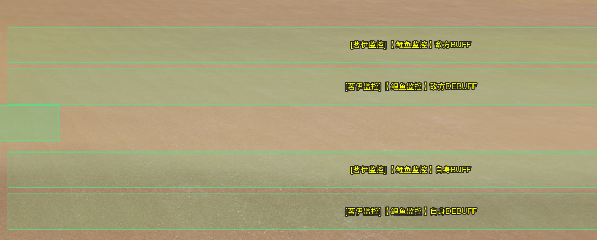
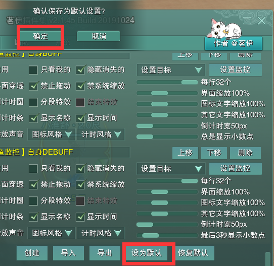
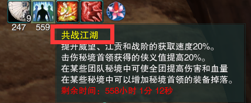

### 鲤鱼监控
**监控基于「茗伊插件集-目标监控模块」实现，可以对于全职业重要Buff/Debuff进行监控。
监控文件可供非盈利性质的分享、修改、二次创作，如果基于以上目的，不用寻求我的同意。**

**制作：双梦镇-归墟子**

>历史版本贴吧连接1：https://tieba.baidu.com/p/5314050246?pid=111742814367&cid=0&red_tag=1609250566#111742814367
>
>历史版本贴吧连接2：https://tieba.baidu.com/p/5314050246?pid=111742814367&cid=0&red_tag=1609250566#111742814367

#### 使用教程
1. 下载获取最新的压缩包，解压后可获得三个文件，分别是README、更新日志、监控文件

    

2. 在游戏中打开「茗伊插件集-目标监控」，点击导入，选取其中后缀为`jx3dat`的监控文件

    

3. 四行模式监控栏从上往下分别是敌方Buff、敌方Debuff、自身Buff、自身Debuff，Buff为白框显示，Debuff为红框显示；两行模式监控栏从上往下分别是敌方Buff/Debuff、自身Buff/Debuff，均为白框显示

    

4. 将监控栏调整到自己喜欢的界面位置

5. 设置为默认设置，小退保存，本机切换其他角色会自动同步，如果没有同步，删除目前已有监控后点击恢复默认-默认设置，或者重新导入一份数据

    
    

6. 如果在使用中遇到问题，可以游戏内密聊归墟子/回复/私信描述你的问题或反馈，看到后会给你回复

#### 下载地址

> 百度网盘：https://pan.baidu.com/s/15pqE1CLvrFX31PnsE-CsoQ 提取码: tk4r 
> 
> GitHub（如果你找不到最新版的网盘时使用）：https://github.com/dunhuixiao/LiyuTargetMon/releases

#### FAQ
1. 如果我不喜欢倒计时、边框风格、右键点掉Buff功能，怎么办？
    
    在茗伊里进行编辑

    

2. 如果我想要添加自己单独的监控怎么办？

    找到你想要添加Buff/Debuff名称，新建后调整即可

    
    

3. 为什么有些Buff没有加入监控？

    Buff加入监控的条件是足够【重要】且非【常驻】，为了整个监控的风格趋于简介，能够一眼抓住重要信息，会比较克制